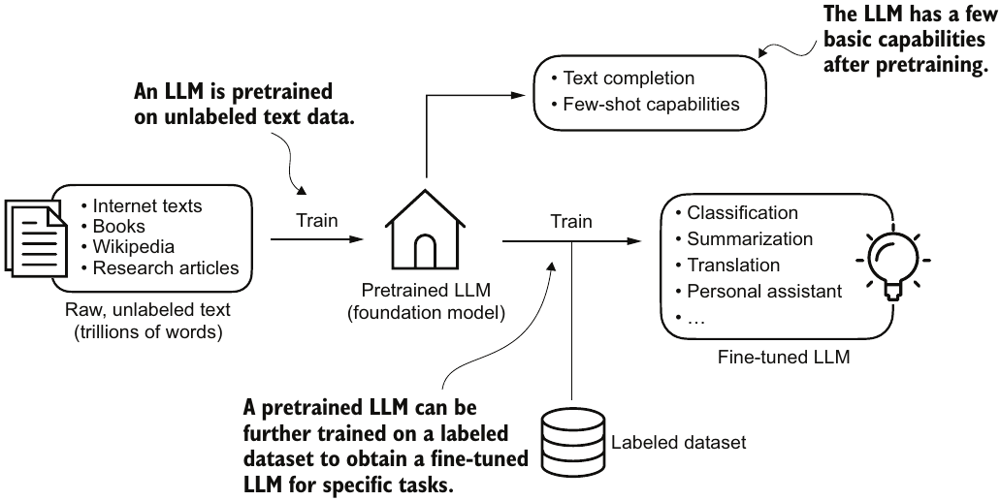
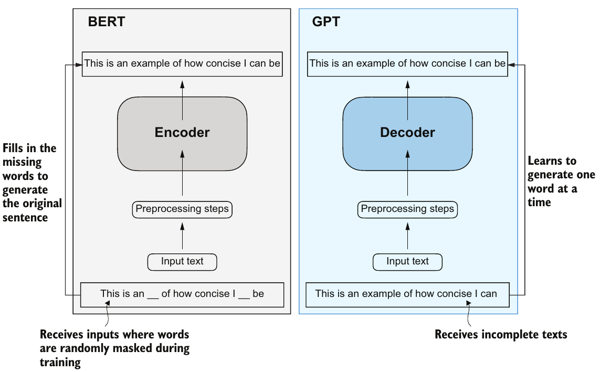

# **Chapter 1: Understanding Large Language Models**

## **1. Introduction to Generative AI and LLMs**

Large Language Models (LLMs) represent a paradigm shift in Natural Language Processing (NLP). Early language systems relied heavily on rigid, hand-crafted rules or simple statistical techniques. In contrast, modern LLMs utilize deep learning architectures to understand, translate, and generate text with human-like fluidity. Because they are designed to produce entirely new text sequences, they are classified as a foundational branch of Generative Artificial Intelligence (GenAI).

The "large" in Large Language Model refers to two distinct attributes:

1. **Model Size:** The scale of the underlying network, measured by billions of trainable parameters (internal variables). For context, the original Transformer architecture repeated its core blocks six times, whereas a model like GPT-3 features 96 dense layers and 175 billion parameters.
2. **Dataset Size:** The massive, multi-billion-word text corpora required to train these parameters effectively.

To develop these massive architectures practically, deep learning libraries like PyTorch are used to handle the heavy computational demands.

## **2. The Two-Stage Training Pipeline**

Building a functional LLM is divided into two primary phases: **Pretraining** and **Fine-Tuning**.

<figure style='text-align: center'>

<figcaption>Pretraining an LLM involves next-word prediction on large text datasets. A pretrained LLM can then be fine-tuned using a smaller labeled dataset.</figcaption>
</figure>

### **Stage 1: Pretraining and Self-Supervised Learning**

The creation of an LLM begins with pretraining on a massive corpus of unannotated, raw text. Unlike traditional neural networks that require humans to manually label training data (supervised learning), LLMs leverage self-supervised learning.

The training task itself is simple: next-word prediction. The model hides the upcoming words in a sentence and attempts to predict them using only the preceding text. Because the "label" is simply the next word already existing in the raw text, labels are generated dynamically "on the fly." This allows engineers to utilize massive, unfiltered internet datasets without manual labeling bottlenecks.

The output of this highly expensive process (with computational costs for models like GPT-3 estimating at upwards of $4.6 million) is called a base or foundation model.

### **Stage 2: Fine-Tuning for Downstream Tasks**

While a foundation model understands grammar and broad facts, it is essentially a text-completion engine. To make it useful, it undergoes fine-tuning—further training on smaller, high-quality, labeled target datasets. Fine-tuning falls primarily into two categories:

* **Instruction Fine-Tuning:** The model is trained on curated instruction-and-answer pairs, teaching it to behave like an assistant or chatbot (the transition from a base model like GPT-3 to an interactive assistant like ChatGPT).
* **Classification Fine-Tuning:** The model learns to categorize text into specific classes, such as dividing incoming emails into "spam" or "not spam."

Fine-tuning requires significantly fewer resources than pretraining, allowing organizations to adapt open-source foundation models to niche domains efficiently.

## **3. Structural Mechanics: The Transformer Architecture**

Virtually all dominant LLMs today are built upon the Transformer architecture, originally introduced in the seminal paper *"Improving Language Understanding by Generative Pre-Training"*.

> **Terminology Note:** While "LLM" and "Transformer" are often used interchangeably, they are not identical. Transformers can be applied to non-text fields like computer vision. Similarly, researchers experiment with recurrent or convolutional networks to design alternative LLMs with lower computing overhead, though Transformer-based models remain the industry standard.

### **Encoder vs. Decoder Layouts**

The original Transformer architecture was designed for machine translation and contained two interconnected halves:

* **The Encoder:** Processes an input text sequence and converts it into a series of dense mathematical vectors capturing contextual meaning. (Example model: **BERT**, which specializes in masked word prediction within a sentence).
* **The Decoder:** Accepts those encoded vectors and generates a brand-new output sequence, one token at a time.

<figure style='text-align: center'>

<figcaption>A visual representation of the transformer’s encoder and decoder submodules. On the left, the
encoder segment exemplifies BERT-like LLMs, which focus on masked word prediction and are primarily used for
tasks like text classification. On the right, the decoder segment showcases GPT-like LLMs, designed for
generative tasks and producing coherent text sequences.</figcaption>
</figure>

Modern generative models like the GPT family simplify this blueprint by stripping away the encoder entirely, utilizing a decoder-only architecture. Because these decoder models feed their own previous word choices back into the input sequence to predict successive words, they are classified as autoregressive models. This sequential dependency ensures that output generation maintains structural coherence over long text blocks.

### **The Self-Attention Mechanism**

The engine driving both modules is the self-attention mechanism. Self-attention allows the model to analyze every word in a sentence simultaneously and mathematically weigh its relevance against every other word. This allows the model to resolve ambiguities (such as identifying what the word "it" refers to in a long paragraph) and successfully map complex, long-range dependencies across text sequences.

## **4. Emergent Properties and In-Context Learning**

One of the most remarkable discoveries of deep learning scale is emergent behavior. When a decoder-only architecture is scaled up to hundreds of billions of parameters, it naturally develops complex capabilities that it was never explicitly programmed or trained to do—such as logical reasoning, code generation, translation, and document summarization.

Because of these emergent properties, users can interact with a trained foundation model using prompting techniques that bypass weight adjustments entirely:

* **Zero-Shot Learning:** Asking the model to perform a completely unique, unseen task without providing any illustrative examples.
* **Few-Shot Learning:** Providing a handful of demonstration examples directly inside the input prompt to teach the model a specific input-output pattern before asking it to process a final prompt.

## **Chapter Summary**

* **Paradigm Shift:** LLMs transformed natural language processing, replacing explicit rule-based systems and simple statistical methods with deep learning approaches capable of understanding, generating, and translating language.
* **Two-Step Training:** Models are first pretrained via self-supervised next-word prediction on massive, unlabeled text blocks to build a foundation model. They are then **fine-tuned** on small, labeled datasets to handle targeted tasks or instructions.
* **The Attention Mechanism:** The Transformer's core innovation is the self-attention mechanism, which grants the model selective access to the entire text sequence simultaneously to capture context accurately.
* **Decoder-Only Design:** While the original Transformer paired an encoder with a decoder, text-generation models like GPT simplify the architecture by utilizing a decoder-only layout.
* **Autoregressive Generation:** Decoder-only models generate text one word at a time, feeding prior outputs back into the network as new inputs to maximize text coherence.
* **Emergent Properties:** Scaling models to billions of parameters triggers emergent behaviors, giving networks the intrinsic capability to classify, summarize, or translate text out of the box.
* **Domain Specialization:** Fine-tuning an open-source foundation model on custom datasets is computationally efficient and frequently outperforms larger, general-purpose models on targeted corporate or research tasks.